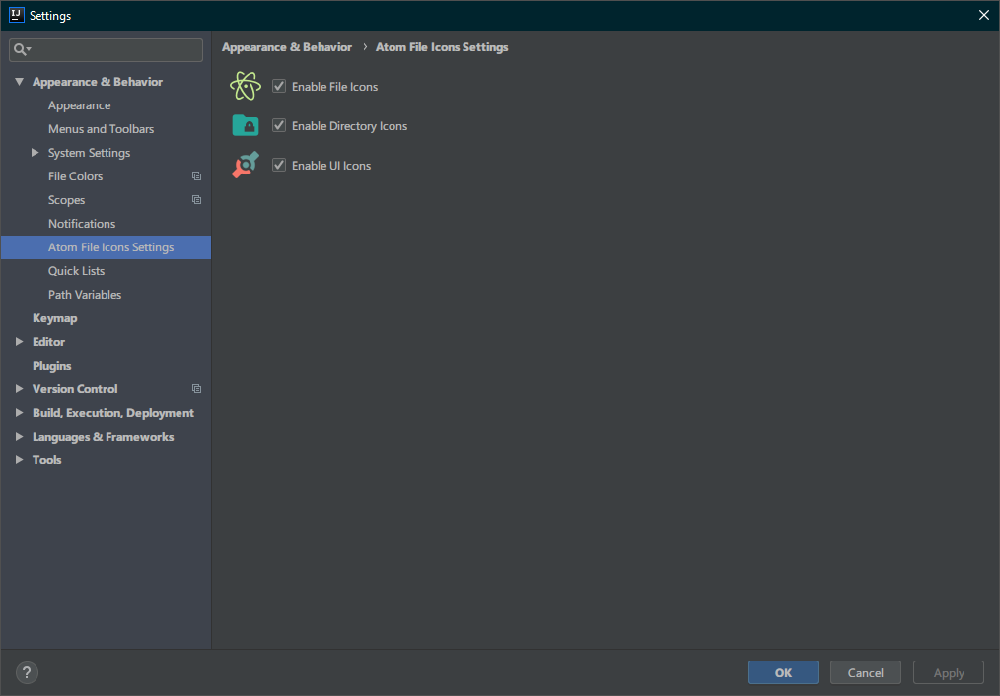
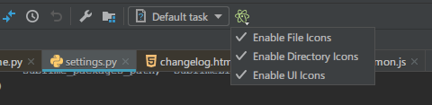

# Atom Material Icons Plugin for JetBrains

<h1 align="center">
   
    
    
  Atom Material File Icons
   
   
</h1>

This plugin is a port of the [Atom File Icons](https://github.com/file-icons/atom) for Atom and the icons of the [Material Theme UI](https://github.com/ChrisRM/material-theme-jetbrains) plugin.

## File Icons

## Folder Icons

## Features

- Replaces **file icons** with their relevant logo icons
  - According to their extension (Java, PHP, Ruby...)
  - According to the framework (Android, NPM, RSpec...)
  - According to the program used with (Babel, Docker, CircleCI...)
- Replaces **directories**:
  - With a common pattern: src, main, app, img, docs...
  - With a specific pattern: node_modules, .vscode, .git...
- Replaces the **PSI (Program Structure Interface)** icons:
  - Classes, Interfaces, Enums, Abstract...
  - Methods, Lambdas, Inherits, Overrides...
- Replaces the **UI Icons**:
  - Toolbar icons (actions)
  - Gutter icons (debugger)
  - Node icons (folders)...
- **Monochrome filter**: Set a filter to the whole UI
  - Ability to select the color
- **Customizability**: Select which settings to apply in a Settings Page

### Settings

### Menu

## Credits

Special credits to:
- The [Material Theme UI plugin](https://www.material-theme.com) for the implementation
- [Atom File Icons](https://github.com/file-icons/atom) and [Sublime Text A File Icon](https://github.com/SublimeText/AFileIcon) for the idea
- [Scientifics Study Vectors](https://www.svgrepo.com/svg/121720/atom) for the plugin icon
- [File-Icons](https://github.com/file-icons/source/blob/master/charmap.md)
- [FontAwesome 4.7.0](https://fontawesome.com/v4.7.0/cheatsheet/)
- [MFixx](https://github.com/file-icons/MFixx/blob/master/charmap.md)
- [Devicons](https://github.com/file-icons/DevOpicons/blob/master/charmap.md)
- [Octicons](https://octicons.github.com/)
- [Material Design Icons](https://materialdesignicons.com/)
