import { Aside, Tabs, TabItem, CardGrid, Card } from "@astrojs/starlight/components";

## Atom Material Icons Configuration

Here is a comprehensive guide to the available configuration options for the Atom Material Icons plugin. You can access these settings via *
*Settings/Preferences** > **Appearance & Behavior** > **Atom Material Icons**.

### Toggle Icons

This section allows you to enable or disable specific categories of icons across the IDE.

- **Enable File Icons**: Replaces default file icons in the Project Tree, lists, and editor tabs.
- **Enable Folder Icons**: Replaces default folder icons in the Project Tree and lists.
- **Enable UI Icons**: Replaces various IDE interface icons (e.g., toolbar buttons, tool window icons).
- **Enable PSI Icons**: Replaces Program Structure Interface (PSI) icons, such as those for classes, interfaces, methods, and variables.
- **Hollow Folders**: When enabled, folders containing files that are currently open in the editor will appear "hollow," making it easier to
  identify active directories.

#### Examples

Without File Icons:
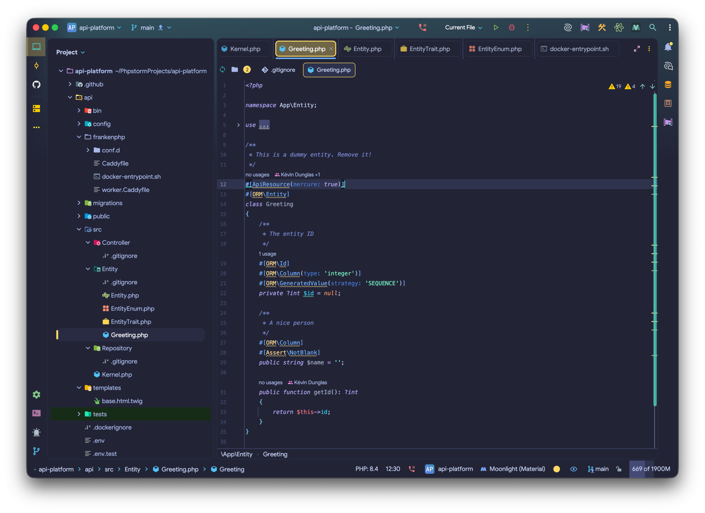

Without Folder Icons:
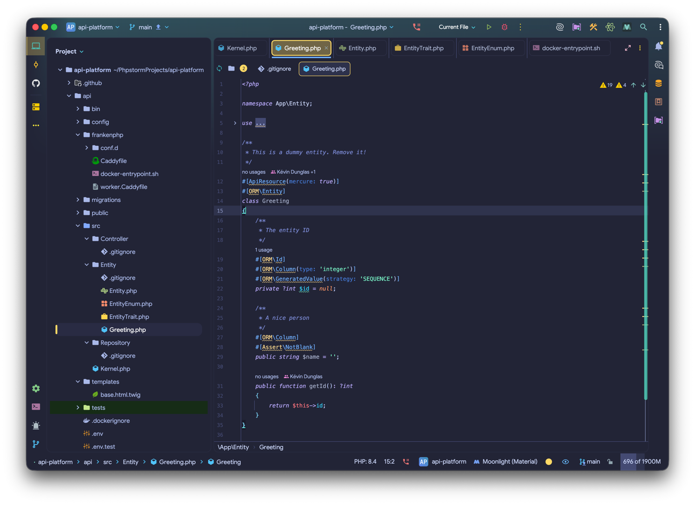

Without PSI Icons:

Hollow Folders:
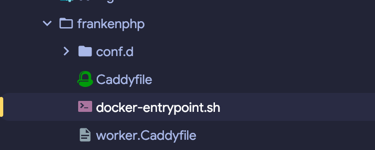

Hollow Decorated Folders:
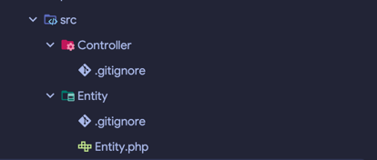

---

### Icon Packs

Icon packs provide specialized icon sets for specific technologies and frameworks.

- **Use Ruby PSI Icons**: Uses Ruby-specific PSI icons instead of standard file icons.
- **Use Rails Custom Icons**: Enables specific icons for Ruby on Rails components (e.g., controllers, jobs, schemas).
- **Use Angular Icons**: Enables dedicated icons for Angular elements (e.g., components, services).
- **Use Angular Icons (Old Icon)**: Uses the legacy design for Angular icons.
- **Use Nest Icons**: Enables specific icons for NestJS components (e.g., controllers, middleware).
- **Use NextJS Icons**: Enables specific icons for NextJS pages and configurations.
- **Use Redux Icons**: Enables dedicated icons for Redux elements (e.g., actions, reducers).
- **Use NgRx Icons**: Enables specific icons for NgRx components (e.g., effects, store).
- **Use New CSS Icon**: Switches to a modern version of the CSS file icon.
- **Use Recoil Icons**: Enables specific icons for Recoil atoms and selectors.
- **Use Tests Icons**: Applies distinct icons to test files to help them stand out from source code.

---

### Hide Icons

If you prefer a more minimalist interface, you can completely hide certain icon types.

- **Hide File Icons**: Removes all file icons from the UI.
- **Hide Folder Icons**: Removes all folder icons from the UI.

Hide File Icons:
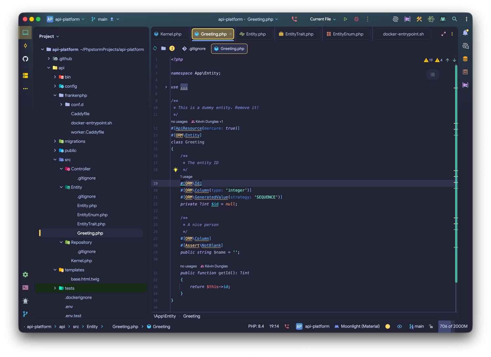

Hide Folder Icons:
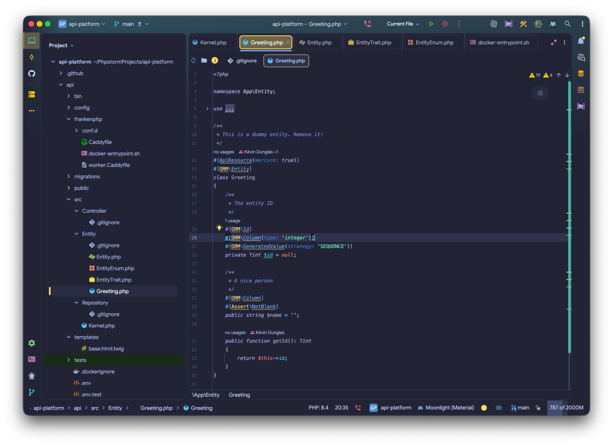

---

### Appearance Settings

Fine-tune the visual style of your icons to match your preferred theme.

- **Custom Accent Color**: Overrides the default accent color of the icons with a color of your choice.
- **Custom Themed Color**: Overrides the primary color of the icons.

Example: Custom Accent and Themed Colors:
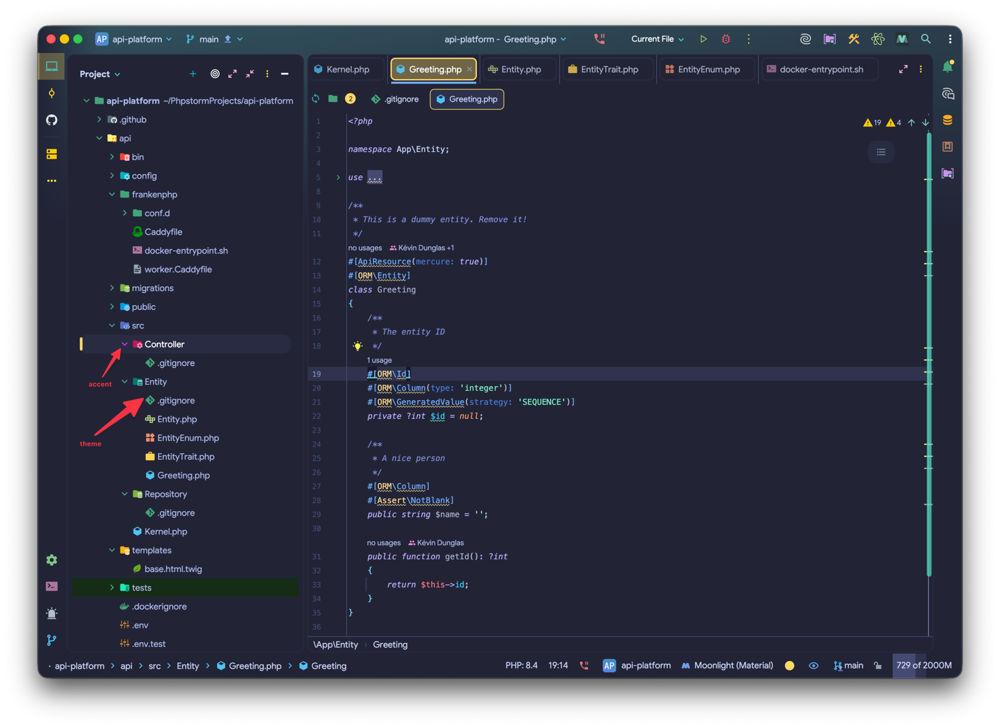

#### Size and Line Height

- **Custom Icon Size**: Set a custom size for the icons (default is 16).
- **Custom Line Height**: Set a custom line height in Tree Views (default is 30).

#### Screenshots

Big Icons:
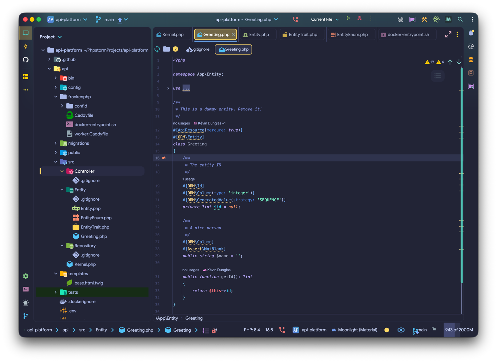

Small Icons:
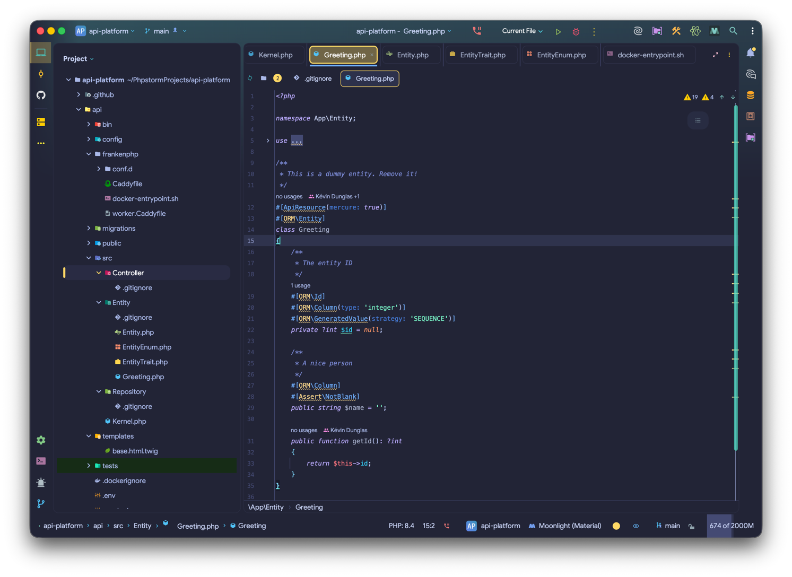

Large Line Height:
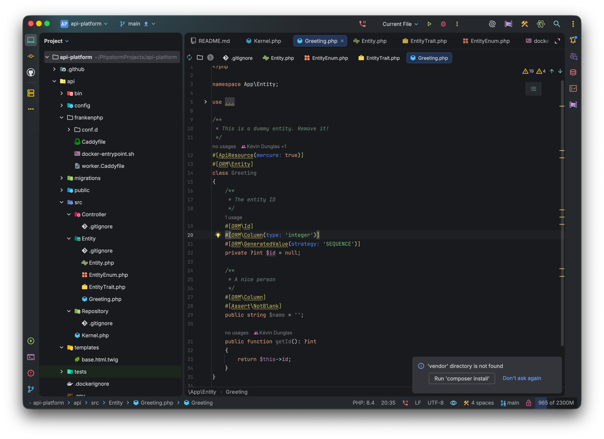

<Aside type="caution">
  The Custom Line Height have no effect when the Material Theme UI plugin is enabled.
</Aside>

---

### Other Settings

- **Monochrome Icons**: Set the whole IDE with a Monochrome filter. The color is customizable.
- **Custom Saturation**: Customize the saturation of the icons (0 is regular, 20 is completely desaturated).
- **Arrows Style**: Change the style of the arrows in trees. Options include Material, Darcula, Plus-Minus, Arrows, and Circle.

#### Screenshots

Monochrome Icons (Blue):
")

Monochrome Icons (Orange):
")

Custom Saturation:
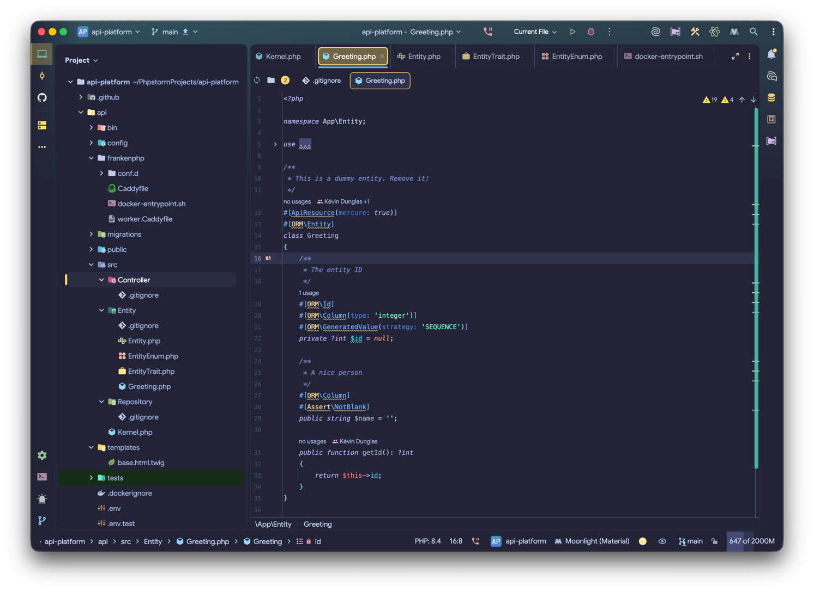

Full Saturation:
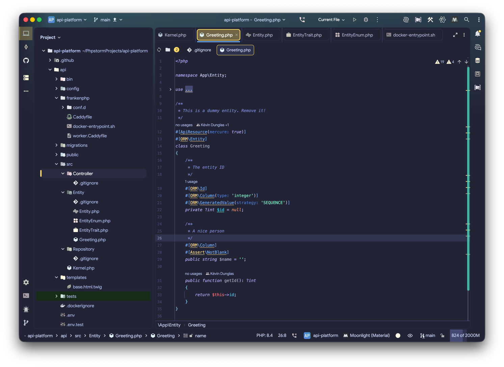

### Arrows Style

Choose between a list of different arrow styles:

- Material: Material Design chevrons
- Darcula: IntelliJ Darcula triangles
- Plus-Minus: Plus and Minus signs
- Arrows: Simple arrows
- Circle: Arrows inside circles
- None: Hide arrows

#### Screenshots

Darcula Arrows:

Plus-Minus Arrows:

Arrows:
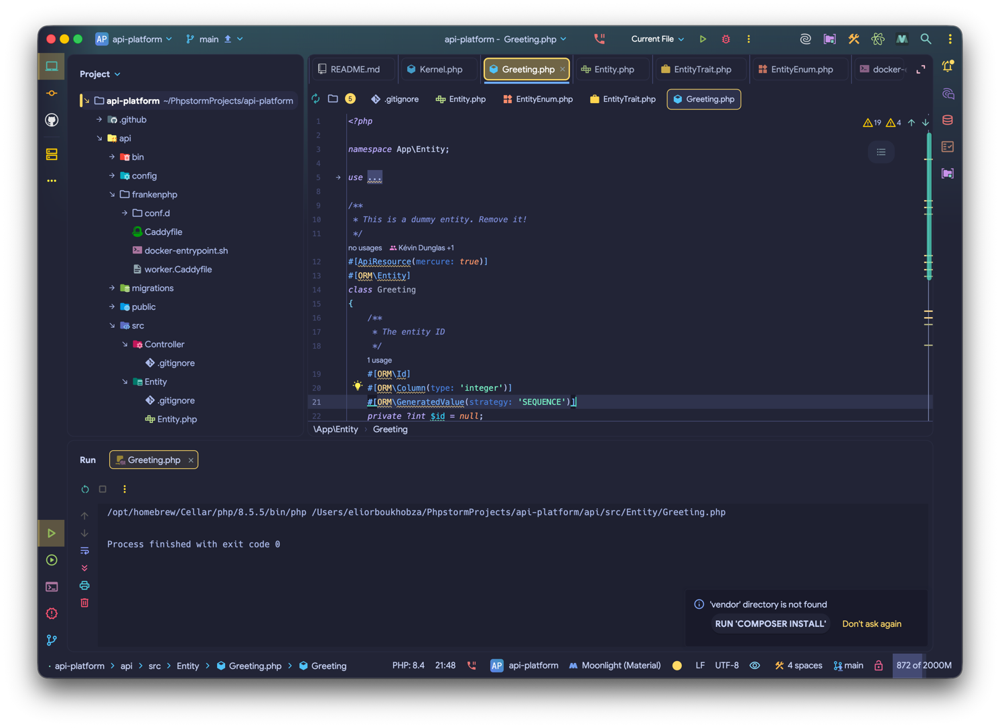

Circle Arrows:
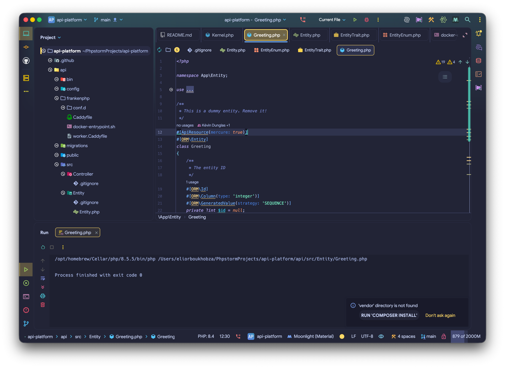

No Arrows:
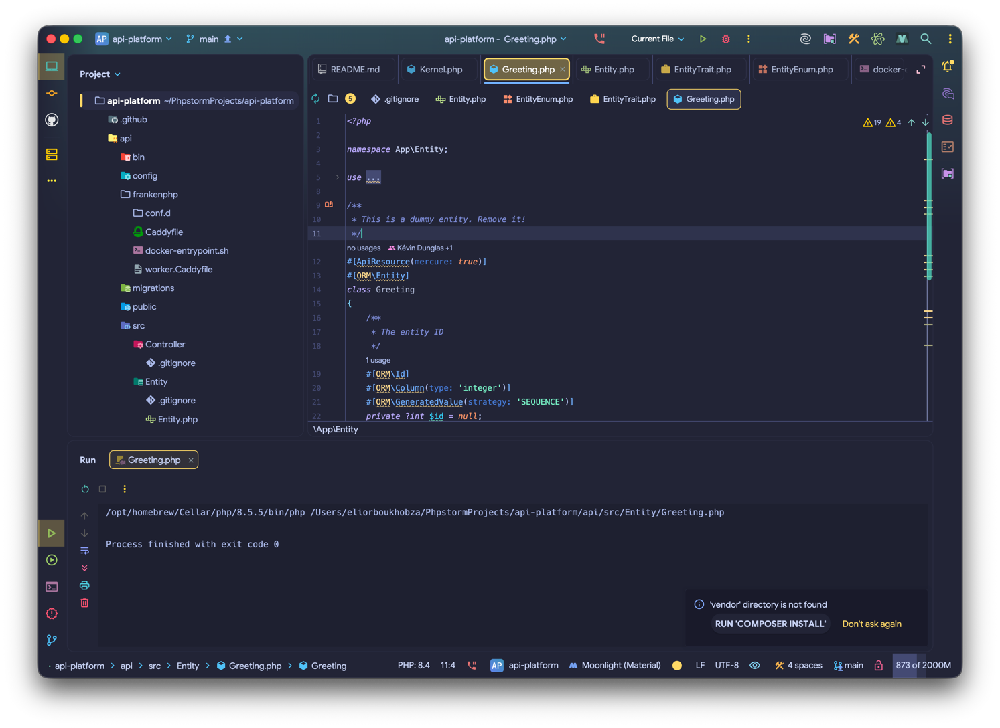

---

### Advanced Settings

- **Enable New Icons (WIP)**: Preview the upcoming "New UI" icon set (Work in Progress).
- **Fix Action Buttons Color**: Ensures action buttons in the toolbar use consistent coloring.
- **Low Power Mode**: Disables project view decorators to reduce resource usage. **Note:** This should be disabled when using the plugin
  with JetBrains Gateway.
- **Disable Icon Indexing**: Turn this setting **OFF** only if you experience IDE crashes that appear related to icon processing.

## What's Next?

Explore advanced customization options:

- [Customization](/usage/customization) - Create advanced icon mappings
